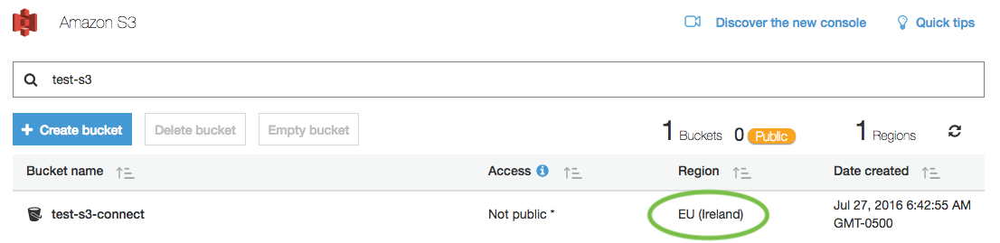

# Amazon Simple Storage Service (S3)

The Amazon Simple Storage Service (S3) support is implemented by using the [AmazonS3Client](https://docs.aws.amazon.com/sdkfornet/v3/apidocs/items/S3/TS3Client.html) class provided in the Aws SDK for .NET.

## UrlFormat

Below is the expected format for Amazon S3 files in the Zephyr.FileSystem.

|Type|Format|Example
|----|------|-------
|File|s3://[bucket]/[path]/[file]|s3://mybucket/dir001/subdir001/myfile.txt
|Directory|s3://[bucket]/[path]/|s3://mybucket/dir001/subdir001/

**Note**: All directories must end in a slash.  Click [here](utilities.md#directory-vs-file-url) for more details.

## Client

A client is a generic term for an object any given implementation needs to sucessfully complete its tasks.   This is usually completely containted within the implemenation classes themselves, exposed through their constructors, but the Utilities classes, which parse URL's and return the cooresponding implementation objects will need these clients as well.

The Amazon Simple Storage Service (S3) implementations require a client.  The AwsClient class provides a wrapper around the [AmazonS3Client](https://docs.aws.amazon.com/sdkfornet/v3/apidocs/items/S3/TS3Client.html) provided in the Aws SDK for .NET.

### Region Endpoints

Regions provided must match the region in which the bucket was created.  This can be found in the S3 console as shown below :

The exception to this rule is if you use the "US East (N. Virginia)" region to create your client.  This will allow access to all regions.

### Credentials

Credentials can be provide explicitly into the classes, or can be pulled from the user's AWS credentails and config files.  If neither of those exist, it will look for environment-based variables representing the current user and their credentials.

See [Configuring AWS Credentails](https://docs.aws.amazon.com/sdk-for-net/v3/developer-guide/net-dg-config-creds.html) for details and other way to establish Amazon credentails to the AwsClient.